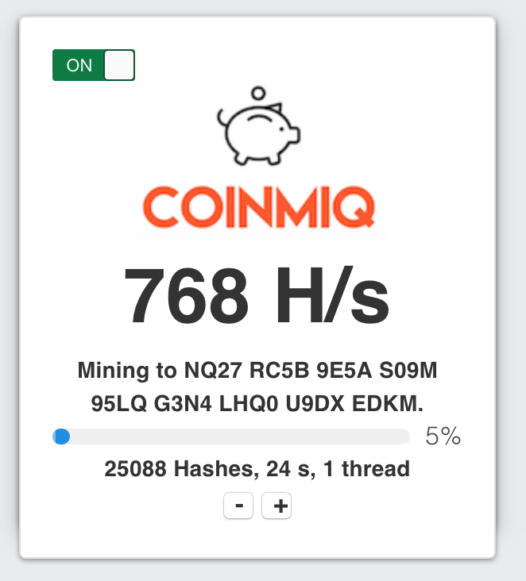

# coinmiq

Coinmiq is a crypto miner for your website. Powered by [Nimiq](http://www.nimiq.com), a blockchain native to the Web.

This project is still under heavy development, but here's a sneak preview.

Planned features:

- A HTML/Javascript widget to mine crypto (NIM) to any address that the user specifies.
- Dashboard to monitor earnings per site.
- Easy exchange of mined NIMs to Bitcoin/Ethereum/Monero via shapeshift, and perhaps to fiat currency as well.
- CAPTCHA that requires proof-of-work to proceed.
- Shortlinks that requires proof-of-work to proceed.
- Special hodler features: deposit crypto earning to a vesting account that cannot be withdrawn until a period of time has passed.
- Other ways to monetise your contents: proof-of-work protected blog posts, articles, etc.