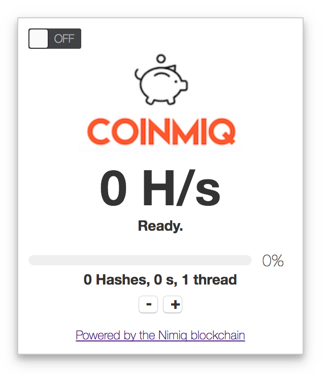

# coinmiq

Coinmiq is a cryptocurrency miner for your website. Powered by [Nimiq](http://www.nimiq.com), a blockchain native to the Web.

Planned features:
-----------------

- [x] A HTML/Javascript widget to mine crypto (NIM) to any address that the user specifies. This has been published as a React component at http://www.github.com/joewandy/react-coinmiq-miner.
- [ ] Mining pool.
- [ ] Dashboard to monitor earnings.
- [ ] Withdrawal of mined coins to Bitcoin/Ethereum/Monero (via shapeshift).
- [ ] Social media tipping bots, e.g. Reddit, Twitter and Telegram.

Experimental features:
----------------------

These features might or might not be implemented.

- [ ] CAPTCHA that requires proof-of-work to proceed.
- [ ] Shortlinks that requires proof-of-work to proceed.
- [ ] Browser extension.
- [ ] Other ways to monetise your contents (see BAT): proof-of-work protected blog posts, articles, etc.